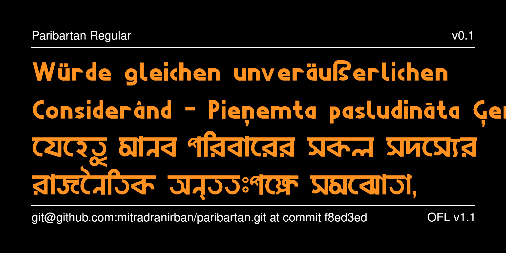

# Paribartan Variable Bengali Font

[![][Fontbakery]](https://googlefonts.github.io/googlefonts-project-template/fontbakery/fontbakery-report.html)
[![][Universal]](https://googlefonts.github.io/googlefonts-project-template/fontbakery/fontbakery-report.html)
[![][GF Profile]](https://googlefonts.github.io/googlefonts-project-template/fontbakery/fontbakery-report.html)
[![][Shaping]](https://googlefonts.github.io/googlefonts-project-template/fontbakery/fontbakery-report.html)

[Fontbakery]: https://img.shields.io/endpoint?url=https%3A%2F%2Fraw.githubusercontent.com%2Fgooglefonts%2Fgooglefonts-project-template%2Fgh-pages%2Fbadges%2Foverall.json
[GF Profile]: https://img.shields.io/endpoint?url=https%3A%2F%2Fraw.githubusercontent.com%2Fgooglefonts%2Fgooglefonts-project-template%2Fgh-pages%2Fbadges%2FGoogleFonts.json
[Outline Correctness]: https://img.shields.io/endpoint?url=https%3A%2F%2Fraw.githubusercontent.com%2Fgooglefonts%2Fgooglefonts-project-template%2Fgh-pages%2Fbadges%2FOutlineCorrectnessChecks.json
[Shaping]: https://img.shields.io/endpoint?url=https%3A%2F%2Fraw.githubusercontent.com%2Fgooglefonts%2Fgooglefonts-project-template%2Fgh-pages%2Fbadges%2FShapingChecks.json
[Universal]: https://img.shields.io/endpoint?url=https%3A%2F%2Fraw.githubusercontent.com%2Fgooglefonts%2Fgooglefonts-project-template%2Fgh-pages%2Fbadges%2FUniversal.json

Paribartan is a Variable Weight and Width Bengali or Bangla Font fully created using Open Source tools.

It is a geometric Sans-Serif design in Latin glyphs and matching design in Bengali Glyphs.

## About

This font is developed by Dr Anirban Mitra, amateur typographer and free software enthusiast

## Building

Fonts are built automatically by GitHub Actions - take a look in the "Actions" tab for the latest build.

If you want to build fonts manually on your own computer:

* `make build` will produce font files.
* `make test` will run [FontBakery](https://github.com/googlefonts/fontbakery)'s quality assurance tests.
* `make proof` will generate HTML proof files.

The proof files and QA tests are also available automatically via GitHub Actions - look at `https://yourname.github.io/your-font-repository-name`.

## Changelog
**Version 0.1 **
- Start of project

## License

This Font Software is licensed under the SIL Open Font License, Version 1.1.
This license is available with a FAQ at https://openfontlicense.org

## Repository Layout

This font repository structure is inspired by [Unified Font Repository v0.3](https://github.com/unified-font-repository/Unified-Font-Repository), modified for the Google Fonts workflow.
